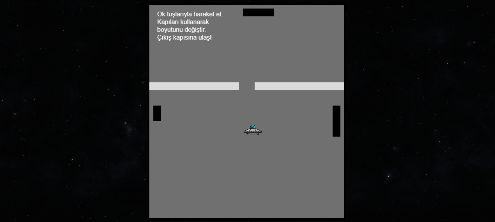
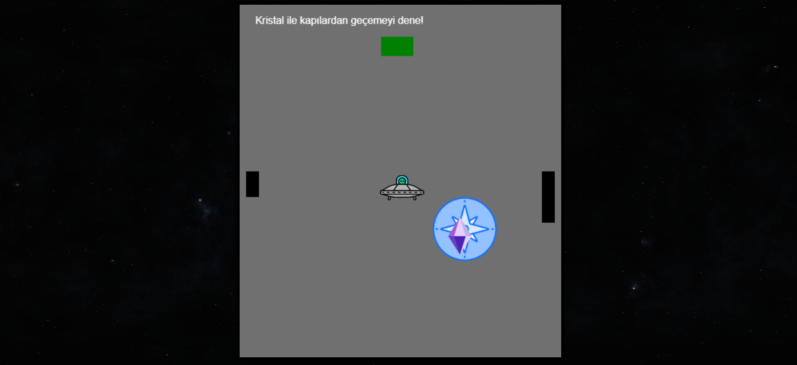

## Crystaverse

Crystaverse, büyüyüp küçülen bir karakter ve nesnerle oynanan escape room mantığında kurgulanmış bir HTML5 ve JavaScript ile canvas kullanılarak kodlanmış bir oyundur. Oyuncu, bir ufo aracını kontrol ederek kristalleri taşıyabilir, büyüyüp küçülebilir ve seviyeler arası geçiş yapabilir. Oyun, her biri farklı zorluklar sunan bölümlerden oluşur.

## 🎮 Oynanış
- **Ok tuşları**: Hareket
- **E tuşu**: Kristali al/bırak
- **Kristalleri topla** ve **aktif alanlara** ulaş
- **Kapılardan geç** ve bir sonraki seviyeye ilerle

## 🧠 Mekanikler
- **Büyüme/Küçülme**: Karakterin bazı yerlere sığabilmesi için boyut değiştirmesi gerekir.
- **Kristal Taşıma**: Karakter, kristalleri taşıyarak mekanizmaları aktive eder.
- **Kapılar**:Karakter kapılardan geçişi ile farklı boyutlarda ve farklı yerlere geçiş yapar.
- **Engeller**:Karakter duvar gibi bi engelle karşılaştığında üzerinden geçemez.
- **Daire(Aktive) Alan**: üzerine karakterin ya da kristalin koyulması ile çıkış kapısını açar ancak üzerine koyulması beklenen krsital boyutu dairenin alanı ile doğru orantılıdır.

## 🚀 Başlamak

Bu oyunu çalıştırmak için verilen linke tıklayın.[https://selenaybulut.github.io/crystavers-game/](https://selenaybulut.github.io/crystavers-game/)

Nasıl oynandığını görmek için verilen linkteki videoyu izleyebilirsiniz.[https://youtu.be/vR8uPGk0Cpo](https://youtu.be/vR8uPGk0Cpo)

## Oyundan görseller 

Oyun başladığında karınca bu seviyede duvarı aşmalı ancak başlangıç boyutu bunun için yeterli değil. 
Büyütme kapısından iki kere geçtikten sonra yeterli büyüklükte oluyor ve çıkış kapısına ulaşıyor.

Oyun başladığında karınca bu seviyede kristali daire alanın büyüklüğüyle orantılı hale getirip taşımalı ancak boyutu bunun için yeterli değil. 

Büyütme kapısından bir kere geçtikten sonra yeterli büyüklükte oluyor ve daire alana koyularak çıkış kapısını aktive ediyo .

## 🔧 Geliştirme
Oyun JavaScript, HTML ve Canvas kullanılarak geliştirilmiştir. Tüm nesneler canvas üzerinde render edilir. Yeni seviyeler eklenebilir.

## 📦 Kaynaklar

### 🔊 Sesler
- **Kristal Toplama Sesi**  
  [axilirate – freesound.org](https://freesound.org/people/axilirate/sounds/592346/)  

- **Arka Plan Müziği**  
  [Purple Planet – Space Temalı Parçalar](https://www.purple-planet.com/tracks?s=space)  
  
### 🎨 Grafikler
- **UFO Figürü**  
  [Alien Ship – Flaticon](https://www.flaticon.com/free-icon/alien_18033834?term=alien+ship&page=4&position=82&origin=search&related_id=18033834)  

- **Kristal Figürü**  
  [Crystal – Flaticon](https://www.flaticon.com/free-icon/crystal_8810390?term=crystal&page=1&position=34&origin=search&related_id=8810390)  

- **Daire Alan (Aktif Nokta)**  
  [Windrose – Flaticon](https://www.flaticon.com/free-icon/windrose_7869308?related_id=7869308)  

- **Uzay Arka Planları**  
  [Space Spheremaps – itch.io](https://space-spheremaps.itch.io/space-spheremaps)

  ### ✨ İlham Kaynağı

  Bu oyun, rekp tarafından geliştirilen Scale the Tree oyunundan esinlenerek oluşturulmuştur. Oyunun temel mekanikleri ve oynanış fikirleri bu projeye ilham vermiştir.[Scale the Tree](https://rekp.itch.io/scale-the-tree)

